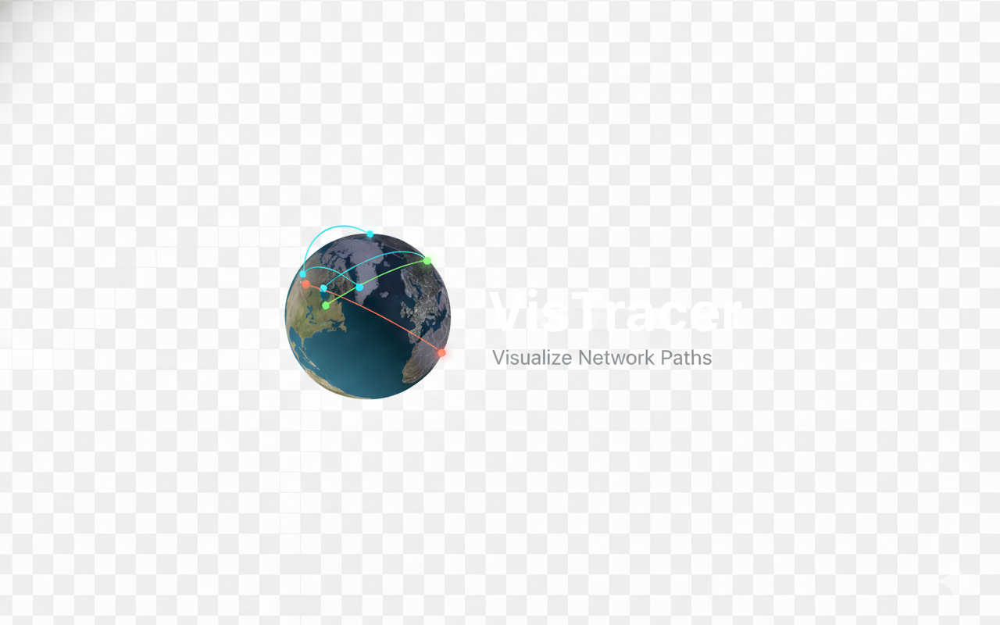
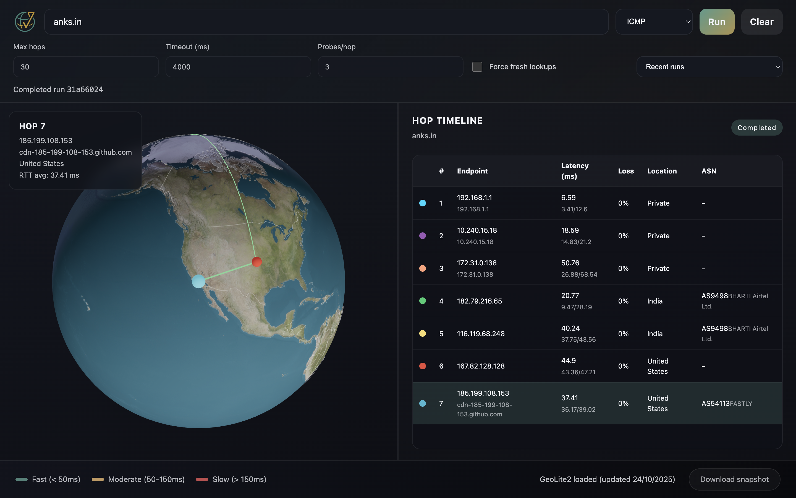
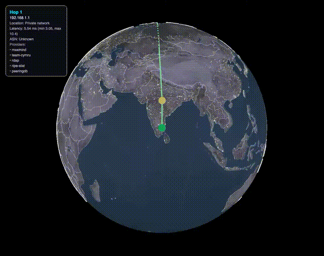

<div align="center">
  

  # VisTracer

  [](https://github.com/rush-skills/vistracer/actions/workflows/ci.yml)
  [](./LICENSE)
  [](https://github.com/rush-skills/vistracer/releases/latest)

  Visual traceroute desktop application built with Electron and React. VisTracer executes traceroute locally, enriches hops with GeoIP, ASN, and external registry metadata, and animates hop-to-hop routes on a 3D globe alongside an interactive hop timeline.

  
</div>

## Download

Pre-built binaries are available on the [Releases](https://github.com/rush-skills/vistracer/releases/latest) page:

| Platform | Format |
|----------|--------|
| macOS    | `.dmg` |
| Windows  | `.exe` (NSIS installer) |
| Linux    | `.AppImage`, `.deb` |

## Why Electron?

VisTracer is built as an Electron desktop application rather than a web app because **traceroute requires native system access**. Web browsers cannot execute system commands like `traceroute` or `tracert` for security reasons. By using Electron, VisTracer can:

- Spawn native traceroute/tracert processes directly on your local machine
- Access system binaries with proper permissions (ICMP requires elevated privileges)
- Read and parse real-time output from the traceroute process
- Provide a true "from your network" perspective for diagnosing connectivity issues

This architecture ensures you get authentic network diagnostics from your actual location and ISP, rather than relying on remote servers or limited browser APIs.

## Core Capabilities

- Cross-platform Electron shell with type-safe IPC between the main process and React renderer.
- Native traceroute execution (ICMP/UDP/TCP) via system binaries with cancellation support.
- Streaming progress updates: hop data appears in the UI as traceroute output is parsed.
- GeoIP/ASN enrichment via local MaxMind GeoLite2 databases with persistent caching.
- Optional secondary enrichment through Team Cymru, RDAP, RIPE Stat, and PeeringDB to fill gaps and validate MaxMind output.
- 3D globe (Three.js) visualising hop arcs, coloured by latency bands, plus per-hop markers.
- Detailed hop table with RTT stats, packet loss, location and ASN metadata (including PeeringDB facility context when available).
- Snapshot and animation exports saved directly to your downloads folder (PNG/JPG/WebP for stills, WebM/GIF for animated routes).

## Getting Started

### Prerequisites

- Node.js 22+ (LTS recommended)
- npm 9+
- Access to the system `traceroute` (macOS/Linux) or `tracert` (Windows) binary.
- **GeoLite2 databases** (optional, but recommended - see below)

### GeoLite2 Databases (Optional)

VisTracer can provide rich geographic visualization and network details when MaxMind GeoLite2 databases are available. The application **will work without them**, but it falls back to public registries, so location and ASN accuracy may drift.

**Quick Setup:**
1. Create a free MaxMind account at https://www.maxmind.com/en/geolite2/signup
2. Download `GeoLite2-City.mmdb` and `GeoLite2-ASN.mmdb`
3. Launch VisTracer, open the settings gear beside the traceroute form, and browse to the downloaded files under **GeoIP databases**

**For detailed setup instructions**, including custom paths and troubleshooting, see [GEOLITE2_SETUP.md](./GEOLITE2_SETUP.md).

If databases are missing, a warning banner will appear in the footer. The same settings modal can be opened directly from the banner or the gear icon—no restart required.

### External Enrichment Providers (Optional)

In addition to GeoLite2, VisTracer can cross-check hop metadata using several public registry services:

| Provider | Purpose | Credentials |
| --- | --- | --- |
| **Team Cymru** | IP ↔ ASN mapping via whois | none |
| **RDAP** (default `https://rdap.org/ip`) | Registry owner/country data | optional custom base URL |
| **RIPE Stat** | Prefix + ASN holder context | identifies as `VisTracer` |
| **PeeringDB** | Facility/operator details for known ASNs | optional API key for higher rate limits |

Use the **Integrations** toggles above the advanced traceroute options to enable or disable each provider. The settings modal exposes credential fields for the services that support them. VisTracer logs every lookup in the Electron console/log file so it is easy to verify which providers responded for a given hop.

### Install Dependencies

```bash
npm install
```

### Development Workflow

Run the Electron + Vite development environment:

```bash
npm run dev
```

The command compiles the Electron main process with `tsc`, starts Vite for the renderer, and launches
Electron once the build products are ready. Renderer changes benefit from fast-refresh.

### Production Build

```bash
npm run build
npm run start   # launches Electron against the production bundles
```

### Desktop Packages

Electron-based installers can now be generated with `electron-builder`. Every packaging command runs the production build first and drops artifacts in `release/`.

```bash
npm run package       # mac dmg + win nsis (.exe) + linux AppImage + deb
npm run package:mac   # macOS dmg (contains the .app bundle)
npm run package:win   # Windows NSIS installer (.exe)
npm run package:linux # Linux AppImage + Debian package
npm run bundle        # produces an unpacked dir for testing (no installer)
```

> **Cross-building tip:** Creating Windows installers from macOS/Linux (or vice versa) requires the platform-specific toolchain (`xcode-select --install` on macOS, `wine`/`mono` for Windows targets, `fpm` for Debian packages). For the most reliable output, run the matching command on that operating system or inside a CI runner/VM that provides the necessary dependencies.

### Linting & Tests

```bash
npm run lint        # ESLint across main + renderer sources
npm run typecheck   # TypeScript project references for both processes
npm run test        # Vitest + Testing Library (renderer-focused)
```

## Project Structure

```
src/
  main/        Electron main process, IPC handlers, traceroute + geo services
  renderer/    React application (modules, state store, Three.js globe, hooks)
  common/      Shared TypeScript contracts between main and renderer
assets/        Static assets (reserved)
```

## GeoLite2 Database Management

Open the settings modal from the gear icon beside the traceroute form (or the footer banner, if shown) to review the current GeoLite2 status and edit paths. The modal displays the last update time along with success/error badges for each file.

- **Configure databases**: Browse to new `.mmdb` files at any time; VisTracer will reload them immediately.
- **Update databases**: Download newer versions from MaxMind and point the modal to the new paths or replace the files in place.
- **No restart required**: Changes take effect as soon as you save.

For detailed instructions on downloading, installing, and updating databases, see [GEOLITE2_SETUP.md](./GEOLITE2_SETUP.md).

**Note**: The application works without databases but provides limited information (no geographic coordinates, city names, or ASN details).

## Dynamic Day/Night Visualization

The 3D globe features a **real-time day/night terminator** that accurately reflects which parts of Earth are currently in darkness based on UTC time. This visualization:

- Updates every second to show the actual position of the sun
- Calculates solar position using declination (seasonal north-south variation ±23.5°) and hour angle (east-west rotation based on time)
- Smoothly blends between the day texture and city lights texture on the dark side
- Accurately represents seasonal variations (solstices and equinoxes) and time of day

The terminator position uses a simplified solar algorithm that provides accuracy within a few degrees—perfect for visualization. The shader compares each surface point's normal with the calculated sun direction to determine illumination.

## Snapshot & Media Export

- Click **Download export** in the footer to capture the current globe.
- Still images support PNG, JPG, and WebP. Animated exports support WebM (hardware-accelerated via `MediaRecorder`) and GIF (bundled encoder).
- Configure the dwell time per hop for animated formats; the tooltip stays on-screen with ASN, PeeringDB, and location details for each hop.
- Files are saved to your system's default download location (typically `~/Downloads` on macOS/Linux or `C:\Users\<username>\Downloads` on Windows).
- Filenames follow the pattern `vistracer-snapshot-YYYY-MM-DDTHH-MM-SS.ext` for stills and `vistracer-route-YYYY-MM-DDTHH-MM-SS.ext` for animations.
- The export button is available once a traceroute run has completed, and MP4 export is intentionally not supported (WebM/GIF cover animation needs without extra codecs).



## Known Gaps & Next Steps

- Automatic GeoLite2 download and scheduled refresh (paths must still be supplied manually)
- Provider rate-limit handling and retry UX for external enrichment APIs
- MP4 export remains out of scope because Electron's built-in encoders focus on WebM; use WebM or GIF instead.
- Advanced heuristics (anycast detection, jitter visualisation, comparison view) are planned but not
  implemented in this build
- Windows environments rely on `tracert`; ensure it is available on `PATH` for the Electron runtime

## Contributing

See [CONTRIBUTING.md](./CONTRIBUTING.md) for development setup, coding standards, and PR workflow.

## Additional Documentation

- [GEOLITE2_SETUP.md](./GEOLITE2_SETUP.md) - Complete guide to downloading and configuring GeoLite2 databases
- [CLAUDE.md](./CLAUDE.md) - Architecture overview and development guide for contributors
- [CHANGELOG.md](./CHANGELOG.md) - Release history
